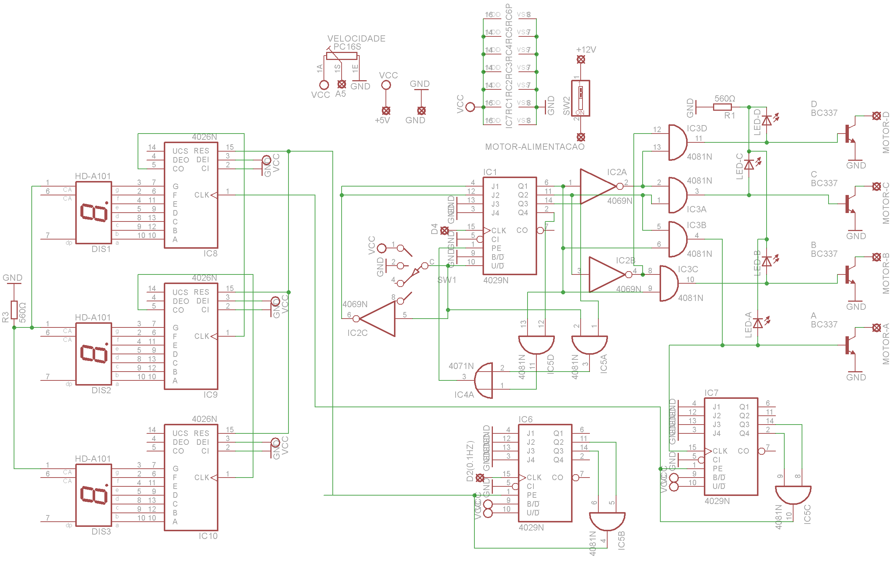
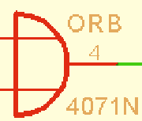
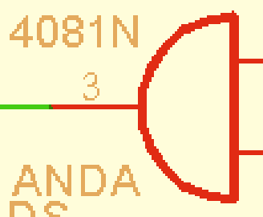

# Introdução

Como atividade avaliativa válida pelo 3º trimestre do 2º ano do curso de eletrônica, pela disciplina de Eletrônica Digital, foi esquematizado e montado um controlador de motor de passo, capaz de controlar a velocidade e sentido de rotação do motor bem como exibir a quantidade de rotações por minuto do motor.

# Materiais utilizados
Os materiais utilizados foram uma protoboard 4 barramentos, circuitos integrados da família CMOS, sendo eles 3x CD4029, 3x CD4026, 1x CD4069, 1x 4071 e 2x 4081, um potenciômetro tipo B 10k (linear), 3x displays catodo de 7 segmentos, resistores diversos 1/4W, LEDs diversos, 4x transistores NPN (BC337), duas chaves comutadoras com duas opções, microcontrolador Arduino, motor de passo unipolar 12V 7,5° por pulso (30° por ciclo) e fonte 12V, além de fios para conexões.

# Esquema Eletrônico

# Funcionamento dos componentes

## CIs contadores
Um CI contador é um circuito que integra diversas células de memória de 1-bit e é montado de maneira que o valor de um número binário de 4 bits é incrementado a cada pulso positivo quadrado na entrada CLOCK. Ou seja, cada vez que a entrada CLOCK passa de 0V para 5V o número binário é incrementado em um.

Este é o funcionamento de um CI CD4029, que possui 4 bits de saída, uma entrada para CLOCK, um pino UP/DOWN, que configura a contagem como crescente quando conectava em 5V e decrescente quando em GND, e um pino PRESET ENABLE, o qual iguala as saídas aos pinos JAM INPUTS. Existe uma jam input correspondente a cada saída, e quando o pino PRESET ENABLE foi acionado, as saídas de transformarão no especificado nas jam inputs. Então, por exemplo, caso J.A esteja configurada como 0, J.B como 1, J.C como 0 e J.D como 1 (sendo J.X a entrada JAM INPUT de X), ao acionar-se PE as saídas tornar-se-ão Qa=0, Qb=1, Qc=0 e Qd=1. O CD4029 também contém outros pinos que não são relevantes nesta análise.

O CD4026 é um contador decimal, que dispõe entrada para CLOCK, um pino RESET (transforma a saída no número decimal zero) e 7 saídas, uma para cada segmento do display.

## Display catodo de 7 segmentos

Os displays utilizados contêm 10 pinos, sendo 2x GND, um para o ponto e os outros 7 são as entradas positivas de cada segmento.

## Transistor NPN (BC337)

 \
O transistor BC337 funciona como uma chave de acionamento digital. Quanto uma tensão é aplicada entre B e E, o transistor atua como uma chave fechada entre C e E. Quando não há diferença de potencial entre B e E, ele age como uma chave aberta entre C e E. A corrente necessária indo de B a E para que o caminho entre C e E esteja completamente livre, agindo como um fio, é baixa. Sendo assim, é possível controlar um fluxo alto de corrente (que passará de C a E) com tensões e correntes baixas (de B a E), vindas, neste caso, dos circuitos integrados e, em última instância, do microcontrolador Arduino. O transistor NPN tem outras funcionalidades que não são relevantes para este projeto.

## CD4069, CD4071 e CD4081

São responsáveis pela lógica necessária e ativam os pinos RESET no momento esperado.

CD4069 contém os pinos de alimentação e mais 6 portas NÃO, que negam a entrada. Se a entrada é 1, a saída é 0, e vice-versa.

 \
CD4071 contém 4 portas OU, que têm 1 como saída se alguma das entradas ou ambas valerem 1, e 0 se ambas as entradas forem 0.

 \
CD4081 contém 4 portas E, que têm 1 como saída caso ambas as entradas sejam positivas, e 0 em qualquer outro caso.

## Chaves comutadoras
São semelhantes a interruptores comuns, porém, ao invés de abrirem ou fecharem o circuito, contêm 3 pinos, sendo o do meio fixo. Os outros 2 pinos estão nas pontas. O interruptor está contínuo do meio para uma das pontas, e assim que pressionado, inverte a ponta que possui continuidade com o meio. Os pinos das pontas nunca são contínuos entre si.

## Microcontrolador Arduino

O microcontrolador Arduino não é necessário neste projeto de controlador de motor de passo, entretanto, espera-se frequências de clocks que para serem geradas em CIs NE555, necessitariam de resistores de baixa resistência, que não seriam o suficiente para proteger o NE555 de altas correntes provindas da fonte. Sendo assim, o Arduino está sendo utilizado estritamente como clock e pode ser substituído por geradores de função. Caso fosse gerado clock usando NE555, o potenciômetro no lugar do resistor que fica entre os pinos 7 e 6, 2 e capacitor faria o papel de aumentar ou diminuir a frequência do sinal. Analogamente, ele será usado para controlar a frequência de clock gerada pelo microcontrolador.

## Motor de passo

O motor de passo é um motor preciso, capaz de girar um ângulo específico. Ele apresenta 5 fios, sendo uma alimentação e os outros quatro representando cada um uma bobina. Internamente estas bobinas estão dispostas circularmente, e, acionando-se uma após a outra, um movimento circular é realizado, e cada bobina que é ativada gira um certo ângulo no eixo principal do motor, que neste caso é 7,5°. Então, para fazê-lo girar, deve-se conectar seu fio de alimentação em 12V e cada bobina deve ser conectada ao pino C dos transistores NPN, cujas saídas E estão aterradas e B, conectadas aos CIs que controlam o acionamento dos transistores, ou seja, controlam as bobinas do motor. Acionando-se uma bobina de cada vez, em sequência (de A a D ou de D a A, o que define o sentido de rotação do eixo), obtêm-se o giro do motor. Quanto mais rápida for a transição entre o acionamento da bobina A, então a B, a C, D, A, e assim por diante, mais rápido será o movimento.

Sendo assim, o controlador do motor de passo consiste em um circuito eletrônico que controla a velocidade de rotação do motor e seu sentido, de acordo com o potenciômetro e a chave comutadora, neste caso. Além disso, será implementado um circuito para contar quantas voltas o motor realiza entorno do próprio eixo, número que será exibido nos displays até as centenas e zerado a cada minuto, para que represente o RPM do motor.

# Funcionamento do circuito

## Acionamento das bobinas
Como visto anteriormente, cada bobina do motor deve ser ativada individualmente e somente uma poderá estar ativa por vez. Chamando as bobinas de A, B, C e D, o controlador precisa gerar as saídas A, B, C e D uma por vez, de acordo com uma certa frequência determinada pela posição do potenciômetro, e enviar o sinal para a base do transistor correspondente, para que este conduza eletricidade pela alimentação do motor, passando pela bobina, pelo transistor e então retornando à referência da fonte.

Será utilizado o LSB (Least Significant Bit) e o próximo bit do contador CD4029, totalizando quando possibilidades entre 00, 01, 10 e 11, para gerar, a partir deles, uma lógica que os transforma em 0001, 0010, 0100 e 1000 respectivamente. Para tal, apelidando os bits do 4029 como X e Y (MSB e LSB, respectivamente), A = X * Y, B = X * Y’, C = X’ * Y e D = X’ * Y’ (‘ é o sinal de negação). Cada uma destas quatro novas saídas é ligada à base do transistor que ativas as bobinas correspondentes e a um LED que sinalizará qual das bobinas estará ligada.

O pino UP/DOWN deste mesmo CI CD4029 será controlado manualmente pela chave comutadora. Quando estiver em 5V (UP), os pinos JAM INPUTS serão todos ligados à referência do circuito e PRESET ENABLE será ativado quando o contador chegar em 4 decimal, ou 0100 binário, ou seja, quando o pino UP/DOWN estiver ligado em 5V PE deve ser ativado quando a saída Qb (a que viria antes de X mencionada anteriormente) valer 1. Entretanto, quando UP/DOWN está em GND, PE é ativado no número que virá após o zero na contagem decrescente, ou seja, 9, ou 1001 em binário. Então, PE deve ser definido como OU quando 5V e Qb valerem 1 OU quando Qa e Qd valerem 1. Além disso, quando UP/DOWN for 5V as JAM INPUTS devem estar como 0000, mas quando ligado em GND, as JAM INPUTS X e Y devem ser 1, para que PRESET ENABLE leve a 4, ou 0011 em binário, cada vez que a contagem decrescente atingir o número seguinte ao zero. Portanto, JAM INPUTS de X e Y são a entrada do pino UP/DOWN negada.

## Contador de RPM

Já que a cada pulso o motor gira 7,5°, a cada ciclo de giro das bobinas o eixo girará 30°. Podemos concluir que em 12 ciclos, 360° são totalizados, ou uma volta. Portanto, o CLOCK de um contador CD4029 (na extrema direita inferior do diagrama esquemático, visto com a folha orientada em paisagem) foi conectado à entrada da base do transistor da bobina A. Ou seja, a cada ciclo de 30°, um pulso é enviado a este clock. Quando o contador registrar 12 decimal ou 1100 em binário, o motor percorreu uma volta. Então, quando o contador registrar 1100 como saídas, ele é restaurado e um pulso de CLOCK é emitido para um contador decimal CD4026, que está conectado a o display das unidades do RPM. CARRY OUT deste CD4026 é ligado ao próximo CD4026, o das dezenas, e então este CARRY OUT ou CLOCK do CD4026 das centenas de RPM.

Há um outro CD4029 cujo CLOCK está conectado a um pino que fornece 0,1Hz, que vem do Arduino. Quando este contador atinge 6, ou seja, passados 60 segundos, um pulso é enviado ao PRESET ENABLE deste contador e também ao RESET de todos os CD4026 que registram as rotações por minuto. Ou seja, os displays exibem a quantidade de rotações do motor, até que são zerados a cada minuto. O último valor exibido antes de os displays voltarem a zero é a média de RPM do último minuto.

## Arduino como gerador de CLOCK

### Clock

Como comentado anteriormente, o circuito integrado NE555 não seria capaz de fornecer a frequência necessária para que o motor girasse mais de 100 vezes por minuto, nem conseguiria gerar um clock de 0,1Hz para a contagem dos minutos por ser uma frequência muito baixa. Por isso o Arduino foi utilizado. Para controlar a frequência do clock ligado ao CD4029 das bobinas, é lido o valor do potenciômetro, que está em uma escala de 0 a 1023 (entrada analógica A5 com 10 bits de resolução). Usando a função map(); tal valor é convertido para encaixar-se na escala de 2 a 240, que corresponde à faixa de frequência desejada em Hz. Para que ondas quadradas com esta frequência sejam geradas, um loop é feito no qual lê-se e calcula-se o valor do potenciômetro, e então inverte-se o sinal da porta digital de saída 4. O loop se repete em um período de 1/(2*freq.), o que gera um clock quadrado com frequência equivalente à calculada, de 2Hz a 240Hz, de acordo com a leitura do potenciômetro. Paralelamente a este loop acontece um outro, que gera um clock de 0,1Hz na porta de saída digital 2. Um loop não interfere no outro e, com a programação adequada, ambos podem ocorrer paralelamente. O código está disponível nesta pasta do repositório.

### Loops paralelos

Resumindo o seu funcionamento, a função millis(); retorna o tempo decorrido em milissegundos desde o início do funcionamento do microcontrolador. Subtraindo o valor retornado por millis(); pelo valor que millis(); retornou no último loop, comparando-se com os intervalos desejados que cada loop dure, pode-se fazer com que um loop ocorra praticamente em paralelo.

# Conclusão pós-montagem

O protótipo montado em protoboard funciona como o esperado até uma certa frequência, porém, o motor de passo não tem a capacidade de manter um movimento contínuo em frequências altas, menores que 240Hz, cujo valor exato ainda se desconhece (uma análise relacionando valores de frequência de clock com o bom funcionamento ou não do motor dariam a resposta). Entretanto, seu movimento é liso em uma certa faixa de frequência. Naturalmente, quando a frequência se aproxima da mínima, o motor tem um comportamento travado, e o giro de 7,5° por pulso é visível, como é de se esperar. Quando a chave comutadora é acionada, o sentido de rotação inverte, conforme o esperado. Os displays mostram a quantidade de voltas completas realizadas e zeram a cada minuto. A velocidade de rotação varia conforme o potenciômetro é girado.

Em geral, o circuito funciona bem, apenas com o problema das altas frequências não reconhecidas pelo motor e que, também, a intensidade dos LEDs tanto que sinalizam quais bobinas estão sendo ativadas quanto dos displays de RPM é baixa, o que pode ser corrigido colocando-se resistores menos resistivos em cada um. Talvez o principal problema no circuito seja a sua fragilidade assim como a dificuldade de acesso dos componentes, além de um mal contato na solda do pino central da chave comutadora. O Arduino está preso à protoboard apenas pelos fios de conexão, o que o torna um objeto a mais a ser carregado junto com a placa. O potenciômetro é de difícil acesso por estar no meio de diversos fios e longe do motor. Estes empecilhos poderiam ter sido evitados com melhor planejamento do posicionamento dos componentes na protoboard.