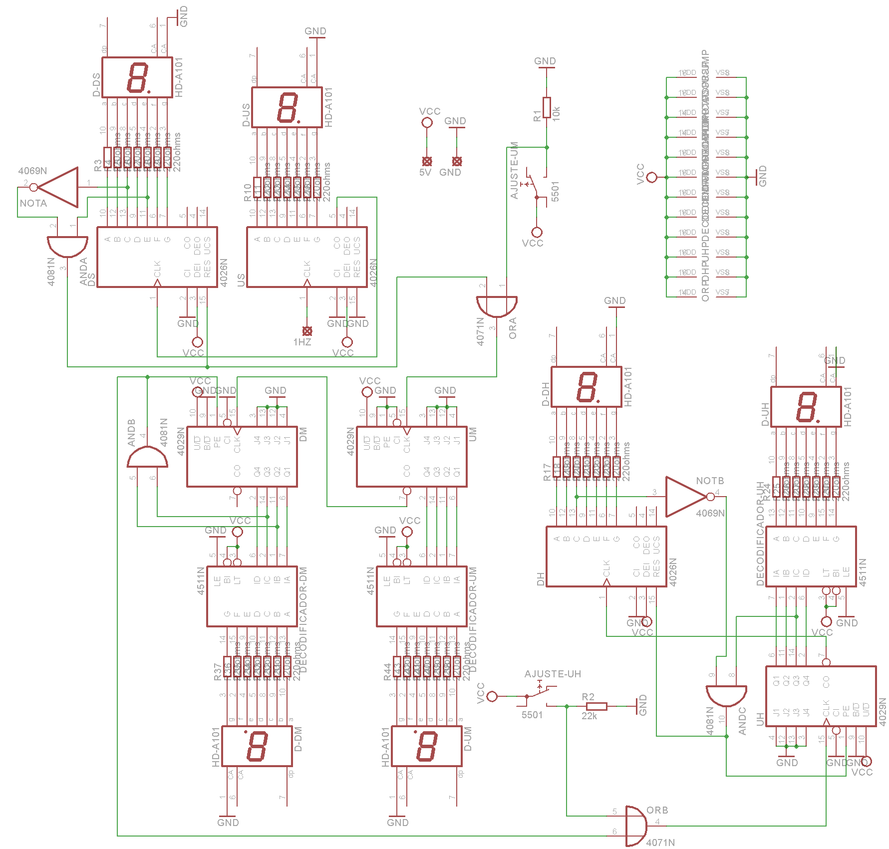
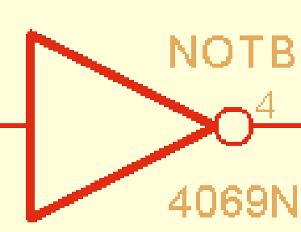
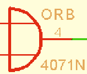
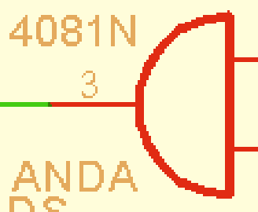

# Introdução

Como atividade avaliativa válida pelo 3º trimestre do 2º ano do curso de eletrônica, pela disciplina de Eletrônica Digital, foi esquematizado e montado um relógio digital o qual mostra as horas através de displays LED simples e com ajuste dos minutos e das horas.

# Materiais utilizados

Os materiais utilizados foram uma protoboard 4 barramentos, circuitos integrados da família CMOS, sendo eles 3x CD4029, 3x CD4511, 3x CD4026, 1x CD4069, 1x 4071 e 1x 4081, 6x displays catodo de 7 segmentos, resistores diversos 1/4W, dois botões de pressão simples e adaptador de fonte para protoboard 5V, além de fios para as conexões.

# Esquema eletrônico

# Funcionamento dos componentes

## CIs contadores

Um CI contador é um circuito que integra diversas células de memória de 1-bit e é montado de maneira que o valor de um número binário de 4 bits é incrementado a cada pulso positivo quadrado na entrada CLOCK. Ou seja, cada vez que a entrada CLOCK passa de 0V para 5V o número binário é incrementado em um.

Este é o funcionamento de um CI CD4029, o qual possui 4 bits de saída, uma entrada para CLOCK, uma saída CARRY OUT para ser ligada em outro CI contador para contagem com mais de 4 bits e um pino PRESET ENABLE, o qual neste caso consideraremos como RESET, ou seja, torna o valor de todos os bits como zero. O CD4029 também contém outros pinos que não são relevantes nesta análise.

O CD4511 atua como decodificador, transformando uma entrada binária em saída decimal para display de 7 segmentos.

O CD4026 é um contador decimal, que dispõe entrada para CLOCK, um pino RESET e 7 saídas, uma para cada segmento do display. Usar um CD4026 para cada um dos 6 displays do relógio simplifica a montagem, porém o almoxarifado da escola, de onde peguei os componentes, apenas dispusera de 3, por isso o uso de outros três contadores binários e decodificadores.

## Display catodo de 7 segmentos

Os displays utilizados contêm 10 pinos, sendo 2x GND, um para o ponto e os outros 7 são as entradas positivas de cada segmento.

## CD4069, CD4071 e CD4081

São responsáveis pela lógica necessária e ativam os pinos RESET no momento esperado.

CD4069 contém os pinos de alimentação e mais 6 portas NÃO, que negam a entrada. Se a entrada é 1, a saída é 0, e vice-versa.

 \
CD4071 contém 4 portas OU, que têm 1 como saída se alguma das entradas ou ambas valerem 1, e 0 se ambas as entradas forem 0.

 \
CD4081 contém 4 portas E, que têm 1 como saída caso ambas as entradas sejam positivas, e 0 em qualquer outro caso.

## Botões simples

Fecham o circuito quando pressionados e abrem caso não estejam pressionados.

# Funcionamento do circuito

Os CIs contadores são identificados por US (unidade dos segundos), DS (dezena dos segundos), UM (unidade dos minutos), e assim por diante. Os decodificadores por DECODIFICADOR-UM para unidade dos minutos e seguindo a lógica. Os displays, por D-US, D-DS, e assim por diante.

A porta CLOCK da US (CD4026) é ligada a um gerador de clock 1Hz, que varia uma vez por segundo, de acordo com a frequência esperada para um relógio. As saídas para os segmentos de D-US são ligadas a resistores e então aos segmentos do display. RESET é aterrado pois US conta de 0 a 9, a sequência decimal completa, a qual é feita automaticamente.

CARRY OUT de US, que emite um pulso crescente cada vez que volta para 0, é ligado ao CLOCK de DS (CD4026). De igual forma, suas saídas são ligadas aos resistores e então aos respectivos segmentos do display. Neste caso, DS deve ser resetado sempre que chegar a 6, o primeiro algarismo na contagem de 0 para cima em que o segmento “c” do display está desligado ao mesmo tempo que “e” está ligado. É feita então a lógica, negando a saída “c” e multiplicando a saída “e”, que resultará em um pulso positivo cada vez que DS valer 6.

A saída que conduzirá o pulso é ligada tanto ao RESET de DS como em uma porta OU, que pulsará em CLOCK de UM (CD4029) sempre que DS atingir 6 ou quando o botão do ajuste dos minutos for pressionado. Ou seja, CLOCK de UM é quando DS chega a 6 ou quando o usuário pressionar o botão de ajuste dos minutos. As saídas binárias de UM são decodificadas e então levadas ao display, passando pelos resistores.

Como UM conta de 0 a 9, seu CARRY OUT é ligado ao CLOCK de DM (C4029), cujas saídas binárias são novamente decodificadas e levadas a D-DM. Entretanto, as saídas B e C de DM são as entradas de uma porta lógica E. Ou seja, quando DM valer 0110 (equivalente ao número 6 em decimal) pulsará 1 em RESET de DM e em uma das entradas de uma porta OU, cuja saída pulsará 1 ao mesmo tempo, que é ligada em CLOCK de UH (CD4029).

A outra entrada da porta OU é ligada ao botão de ajuste das horas, para que o CLOCK de UH pulse ou quando DM valer 6 ou quando o usuário pressionar o ajuste das horas. As saídas binárias de UH são decodificadas e levadas a D-UH.

UH retorna a zero automaticamente após exibir 9 por um segundo, mas também deve retornar caso DH valha 2 e UH atinja 4. Para isso, usou-se a lógica de que quando o segmento “c” de D-DH estiver desligado (primeira vez que ocorre é quando o display exibe 2 em contagem crescente partindo de zero) e o bit C de UH valer 1 binário (primeira vez em que ocorre é em 4 decimal, ou 0100 binário, em contagem crescente partindo de zero) ao mesmo tempo, retorna-se a 0 tanto UH como DH. Para melhor compreensão, vide esquema eletrônico.

# Conclusão pós-montagem

O protótipo montado em protoboard funciona como o esperado. Após o ajuste do horário, o relógio exibe a hora correta, tendo os segundos indo de 00 a 59, incrementando um minuto que vai até 59, que incrementa uma hora que vai até 23 e então retorna a 0. Entretanto, possui possíveis melhorias.

Uma delas é que quando ligado, começa exibindo um horário aleatório. Também, para ajustá-lo mais precisamente, um botão que zera tanto a unidade quando a dezena dos segundos pode ser adicionado, já que ambos não são ajustáveis na configuração atual. Além disso, o relógio atrasa 20 segundos a cada 24 horas devido à falta de precisão da entrada de 1Hz, que determina a frequência da contagem. Por último, às vezes, quando pressionado o botão de ajuste tanto dos minutos como o das horas para incrementá-los manualmente, o valor é acrescido de um número maior que 1 por razões ainda desconhecidas.