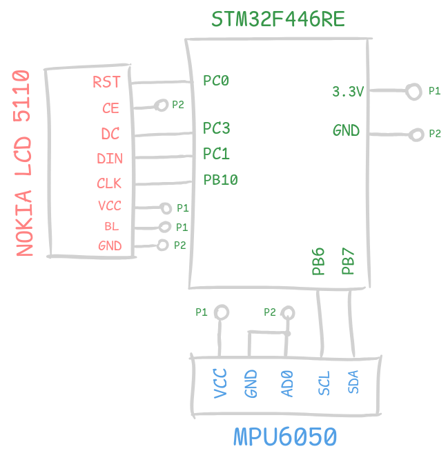
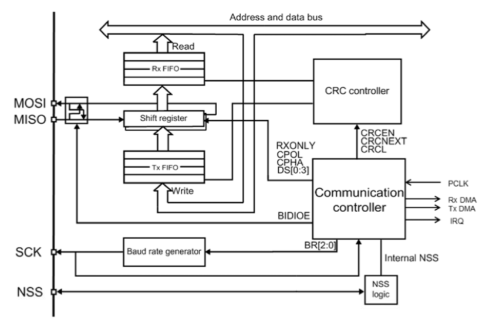
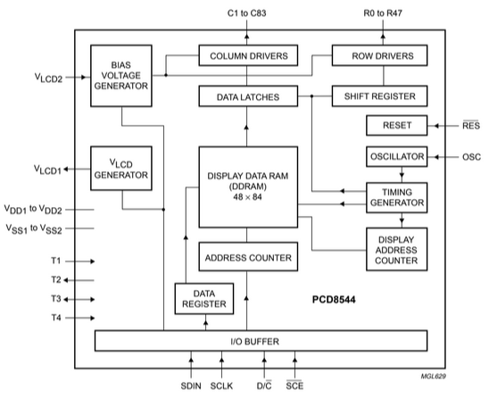
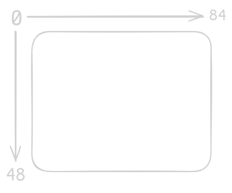
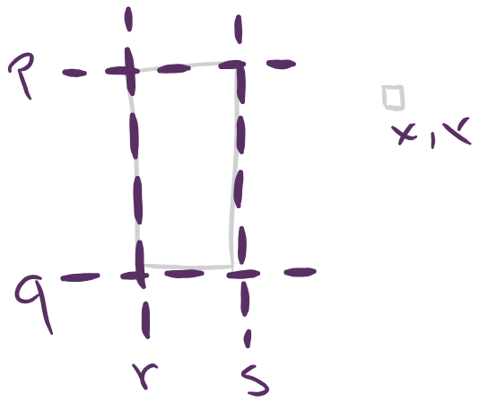
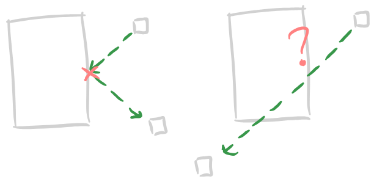

# Air Hockey - V0.1
By Davi da Silva Schuch and Edrick Thomé de Oliveira \
Sistemas Microprocessados II - Professor Marcos Zuccolotto

## Table of Contents
- [Briefing](#briefing)
    - [Technologies Used](#technologies-used)
    - [Schematic Diagram](#schematic-diagram)
- [SPI](#spi)
    - [Pins](#pins)
    - [Shift Register / Operation Modes](#shift-register--operation-modes)
    - [Clock Polarity and Phase](#clock-polarity-and-phase)
- [Nokia 5110 LCD Display](#nokia-5110-lcd-display)
    - [Pins](#pins-1)
    - [Library](#library)
- [Game](#game)
    - [Order and Update](#order-and-update)
        - [Display Orientation](#display-orientation)
        - [Update Rate](#update-rate)
    - [Collision](#collision)
        - [Screen Boundaries](#screen-boundaries)
        - [Object Collision](#object-collision)
        - [Puck Acceleration](#puck-acceleration)
        - [Tunneling](#tunneling)

## Briefing
The following project implements a digital adaptation of an air hockey game, using an LCD display for game rendering and an accelerometer and gyroscope module for control.

### Technologies Used
- STM32F446RE Microcontroller
- MPU6050 - 3-axis accelerometer and gyroscope
- Nokia LCD 5110 Display
- SPI serial communication for the display, and I2C for the accelerometer

### Schematic Diagram


## SPI
The SPI protocol is a serial communication method used over short distances, primarily for embedded systems. It operates in a Master-Slave system, meaning the device generating the synchronization signal is the master, and all devices using that signal are slaves.
SPI also supports Full Duplex (simultaneous send/receive), Half Duplex, and Uniplex (only sending or only receiving).

### Pins
SPI communication is done through four pins as shown below:

| Name | Pin | Purpose |
| - | - | - |
| Master Out Slave In | MOSI | Sends commands from master to slave |
| Master In Slave Out | MISO | Sends commands from slave to master |
| Serial Clock | SCK | Sends the clock from master to slaves |
| Slave Select | SS | Activates communication with the slave device |

Alternate names are possible, as will be seen in the LCD display used, due to lack of standardization. It's up to the user to correctly interpret based on documentation and action to be executed.

### Shift Register / Operation Modes
SPI communication happens via a shift register that, at each clock rising edge, shifts one bit from the data register to the right.

As this is a shared register between the Tx FIFO and Rx FIFO, interaction may depend on the operation mode. Here's a simplified block diagram of an SPI master device:

*Source: STM32 SPI Documentation*

Note that MOSI takes the last bit from the register and MISO inserts a bit at the first position. The transmission queue (containing data to be transfered to another device through MOSI) is copied to the shift register, while the reception queue (MISO) receives the data from it.

For simultaneous communication, each bit sent by MOSI returns a bit via MISO, cycling the shift register according to the figure below:

*Source: Hackaday*

For this project, we’ll use Uniplex communication, since the LCD display only requires synchronous serial data and has no data output.

### Clock Polarity and Phase
The SPI standard allows configuration of clock behavior through the variables polarity (CPOL) and phase (CPHA).

Polarity indicates the clock’s idle state (0 = low, 1 = high). Phase determines whether reading starts on the first or second clock transition.

Interpreted as:

| CPOL | CPHA | Reading | Transition |
| - | - | - | - |
| 0 | 0 | Rising edge | First |
| 0 | 1 | Falling edge | Second |
| 1 | 0 | Falling edge | First |
| 1 | 1 | Rising edge | Second |

Graph for better understanding:

*Source: STM32 SPI Documentation*

**Sources:**
- "Interface serial SPI", material developed and provided by Prof. Zuccolotto
- [STM32 Serial Peripheral Interface](https://www.st.com/content/ccc/resource/training/technical/product_training/group0/3e/ee/cd/b7/84/4b/45/ee/STM32F7_Peripheral_SPI/files/STM32F7_Peripheral_SPI.pdf), by STMicroelectronics
- [Comunicação SPI – Parte 1](https://embarcados.com.br/spi-parte-1/), by embarcados.com.br
- [Comunicação SPI - Parte 2](https://embarcados.com.br/comunicacao-spi-parte-2/), by embarcados.com.br
- [What could go wrong: SPI](https://hackaday.com/2016/07/01/what-could-go-wrong-spi/), by hackaday.com

## Nokia 5110 LCD Display
Used for output, the LCD 5110 display is widely available and low cost. With 48 rows and 84 columns, it supports only one color, has a max serial input rate of 4 Mbps, and is CMOS-compatible.

### Pins
Pinout of the used device (note that names may vary due to lack of standardization):

| Name | Pin | Purpose |
| - | - | - |
| - | VCC | Power supply |
| - | GND | Ground |
| Back Light | BL | Display backlight |
| Data Input | DIN | Serial data input |
| Clock | CLK | Clock input |
| Chip Enable | CE | Enables serial data reception |
| Data/Command | D/C | Switches operation mode |
| Reset | RST | Clears the display memory |

*Source: ETT Documentation*

This display lacks a data output and only depends on master outputs, so only master outputs are used in SPI configuration.

Manual control of reset, data/command, and chip enable pins is required for full operation.

### Library
With display and protocol documentation in hand, we could create our own driver. But to simplify, we use a public library from GitHub, abstracting initialization, data sending, and port toggling.

Library used: "winxos/stm32_hal_lcd5110_hw_spi", retrieved on May 23, 2025. Available [here](https://github.com/winxos/stm32_hal_lcd5110_hw_spi).

## Game
The game consists of two objects: a "puck" and a "paddle", both block-shaped. Collision must be programmed, requiring both objects to have position, direction, speed, etc.

### Order and Update
#### Display Orientation
The display’s coordinate system does not match Cartesian: x increases to the right, but y increases downward.

 \
*Source: Own authorship*

#### Update Rate
To simplify programming and leverage microcontroller tools, movement speed is controlled by a timer that regulates the position update rate.

Example code for updating the ball’s position:

```
void HAL_TIM_PeriodElapsedCallback(TIM_HandleTypeDef *htim) {
	if (htim->Instance == TIM11) {  //10Hz
		moveBall(); //update ball position
    }
    if (htim->Instance == TIM14) {  //50Hz
        ... //update screen
    }
}

void moveBall() { //increase or decrease position by one
    if (ball.xDirection == UP) ball.xPosition = ++ball.xPosition;
    else ball.xPosition = --ball.xPosition;

    if (ball.yDirection == LEFT) ball.yPosition = ++ball.yPosition;
    else ball.yPosition = --ball.yPosition;
}
```

### Collision
Collision is key — when objects touch, the player's movement affects the puck. Current implementation is discrete, checking if objects are currently overlapping.

#### Screen Boundaries
First, we handle screen boundary collisions: if the paddle hits the screen edge, it stops. For the puck, we check if it hit a horizontal or vertical edge, and invert the corresponding direction.

#### Object Collision
Occurs when any edge or diagonal of one object aligns with the other's. Given that object position is its center, we calculate edges using width and height:

*Source: Own authorship*

```
int p = stick.yPosition - (stick.height / 2),
    q = stick.yPosition + (stick.height / 2),
    r = stick.xPosition - (stick.width / 2),
    s = stick.xPosition + (stick.width / 2);
int x = ball.xPosition, y = ball.yPosition;
```

As noted earlier, remember the y-axis increases downward.

To detect collisions (e.g., right edge of paddle), check if y is between *p* and *q* and x equals *s*:

```
if ((y > p) && (y < q) && (x == s)) { //right side collision
    ...
}
```

#### Puck Acceleration
When a collision is detected, the puck must speed up. Since force isn't implemented, we use the update timer.

On collision, the update rate changes from 10 Hz to 50 Hz for one second, simulating a speed increase, then reverts.

#### Tunneling
With variable speeds, a problem called tunneling may occur: if an object moves considerably quicker than the other, its position may change in a way that it tunnels through the object it should collide with. In our application, the puck can move past the paddle without detection. Below, expected behavior is on the left, tunneling on the right:

*Source: Own authorship*

To fix this, a continuous collision algorithm is required, predicting the object's path and collision point.
